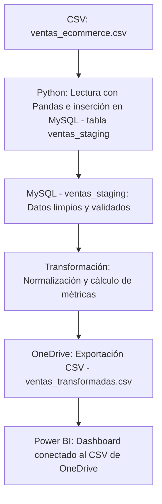

 # 🧠 InsightStream  
### Automatización de Datos para E-Commerce – Pipeline End to End

---

## 📊 Descripción General  

**InsightStream** automatiza la **carga, transformación y visualización de datos de ventas** desde un archivo CSV hasta **dashboards dinámicos en Power BI**, utilizando **Python, MySQL, OneDrive y Power BI**.  

El flujo completo garantiza credenciales seguras y un proceso automatizado, ideal para escenarios de e-commerce o análisis de ventas.

---

## 🧩 Pipeline Visual



## 🎯 Objetivos del Proyecto  

- Automatizar la carga y transformación de datos de ventas e-commerce.  
- Mantener credenciales seguras mediante variables de entorno.  
- Exportar automáticamente los datos finales a OneDrive.  
- Conectar Power BI para visualización y análisis dinámico.  

---

## 🛠️ Tecnologías Utilizadas  

| Herramienta | Logo | Descripción |
|--------------|------|-------------|
| **Python** | 🐍 | Motor ETL: lectura, validación y exportación |
| **Pandas** | 📊 | Limpieza y transformación de datos |
| **MySQL** | 🗄️ | Base de datos staging |
| **OneDrive** | ☁️ | Almacenamiento del CSV final |
| **Power BI** | 📈 | Dashboards interactivos |
| **VS Code** | 💻 | Desarrollo y pruebas |
| **GitHub** | 🐙 | Control de versiones y documentación |

> 🔹 Los datos utilizados son **sintéticos** y se comparten únicamente con fines demostrativos.

---

## 📂 Estructura del Proyecto  

```
InsightStream/
│
├── data/
│   └── ventas_ecommerce.csv
│
├── scripts/
│   ├── extract_load.py      # Carga CSV → MySQL (staging)
│   └── transform.py         # Limpieza y exportación CSV a OneDrive
│
├── dashboard/
│   └── dashboard_InsightStream_ecommerce.pbix   # Dashboard Power BI
│
├── docs/
│   └── documentación_ETL.docx
│
└── .env                     # Variables de entorno seguras
```

---

## ⚙️ ETL Paso a Paso  

### 🐍 1. Extract & Load  
- Lectura del archivo `ventas_ecommerce.csv` con **Pandas**.
  
## 🔐 Gestión Segura de Credenciales  
Todas las credenciales se almacenan en el archivo `.env`.  
No se exponen en el código ni en el repositorio.  

Ejemplo:
```bash
DB_HOST_MYSQL=******
DB_USER=******
DATASOURCE_PASSWORD=********
DB_ECOMMERCE_MYSQL=********
```

- Inserción en `ventas_staging` con control de duplicados mediante `ON DUPLICATE KEY UPDATE`.

---

### 🔄 2. Transformación  
- Limpieza de nulos y normalización de texto (`str.title()`, `unidecode`).  
- Cálculos:  

```python
ticket_promedio = total / cantidad
coherente = total == cantidad * precio_unitario
```

- Formato monetario: `$ 1.234,56`

---

### ☁️ 3. Exportación a OneDrive  
Exporta automáticamente la tabla final a CSV:

```python
output_path = r"C:\Users\<usuario>\OneDrive\InsightStream\datasets\ventas_transformadas.csv"
df_final.to_csv(output_path, index=False, encoding='utf-8-sig')
```

> Power BI se conecta directamente al CSV en OneDrive, garantizando actualizaciones automáticas con cada ejecución del script.

---

### 📊 4. Visualización en Power BI  

Dashboard conectado al CSV final con las siguientes vistas:

- **Dashboard General:** KPIs de ventas totales, cantidad, ticket promedio y coherencia  
- **Tendencias:** Ventas mensuales y por categoría  
- **Top Productos y Facturación**  
- **Tabla dinámica:** Categoría | Producto | Total | Cantidad  
- **Filtros interactivos:** Fecha | Categoría | Tipo de valor
  
[Dashboard interactivo](https://bit.ly/4nLLeel)  

---

## 💡 Ejemplo de Transformación  

| Comprobante | Producto | Categoría | Cantidad | Precio Unitario | Total | Coherente | Ticket Promedio | Total Formateado |
|--------------|-----------|------------|-----------|------------------|---------|------------|------------------|------------------|
| C001 | Smartphone X | Tecnología | 1 | 226,934.00 | 226,934.00 | ✅ | 226,934.00 | $ 226.934,00 |
| C002 | Remera Oversize | Ropa | 1 | 463,728.00 | 463,728.00 | ✅ | 463,728.00 | $ 463.728,00 |

---

## 🧩 Extensiones Recomendadas (VS Code)  

| Extensión | Autor | Función | Uso |
|------------|--------|----------|------|
| Python | Microsoft | Soporte de Python, debugging, linting | Scripts ETL |
| Jupyter | Microsoft | Notebooks con gráficos y texto | Documentación técnica |
| Pylance | Microsoft | Autocompletado avanzado | Escritura limpia |
| SQLTools | Matheus Teixeira | Gestión de bases de datos | Queries MySQL |
| GitHub PRs & Issues | GitHub | Integración con repositorios | Control de versiones |

---

## ✅ Resultados Finales  

✔️ Conexión **Python ↔ MySQL** funcional  
✔️ Transformaciones validadas y coherentes  
✔️ Exportación automática a **OneDrive**  
✔️ Dashboard en **Power BI** actualizado en tiempo real  
✔️ Credenciales seguras en `.env`

---

## 🚀 Próximos Pasos  

- Automatizar la ejecución del pipeline (tareas programadas o cron).  
- Incorporar alertas automáticas ante incoherencias.  
- Extender métricas en Power BI (márgenes, rentabilidad, top clientes).  

---

## 👩‍💻 Autor  

Proyecto desarrollado por **Priscila Kwiatkowski**  
📧 [priscilakwiatkowski44@gmail.com](mailto:priscilakwiatkowski44@gmail.com)  
💼 [LinkedIn](https://www.linkedin.com/in/priscila-kwiatkowski/)  
🐙 [GitHub](https://github.com/Priska-87)

---

